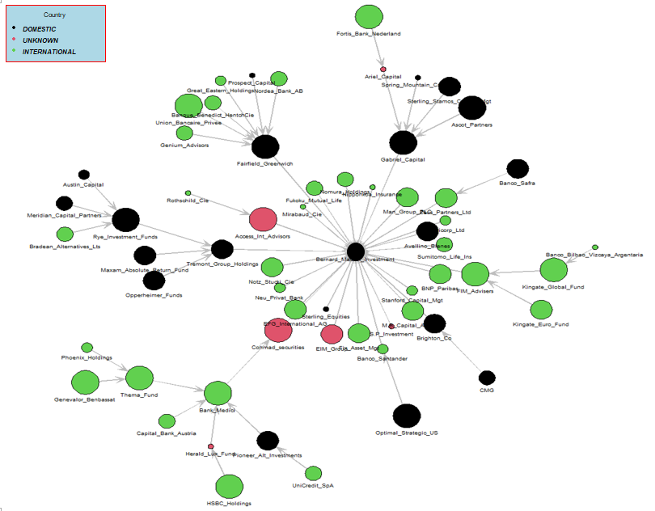
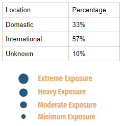
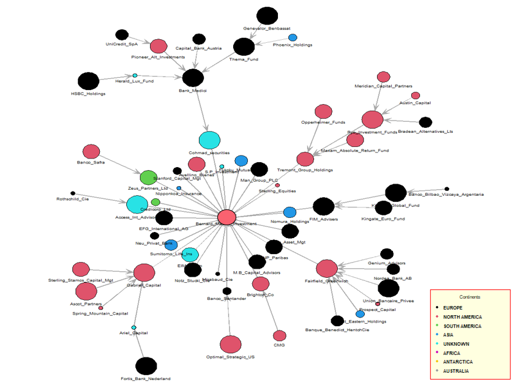
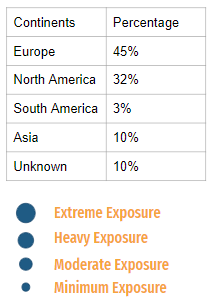
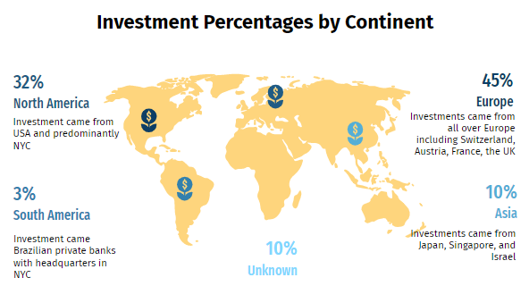
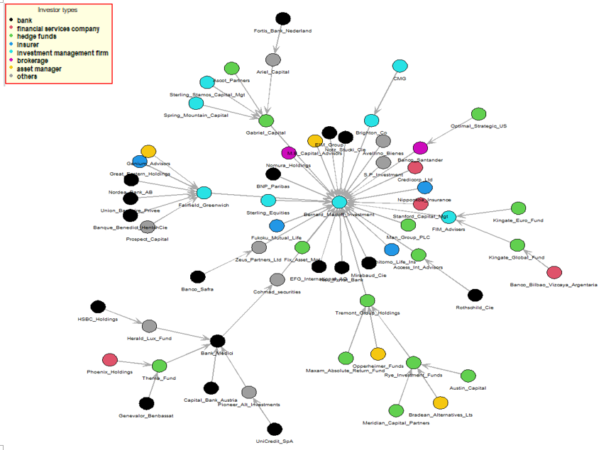
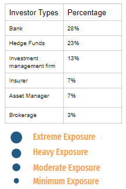
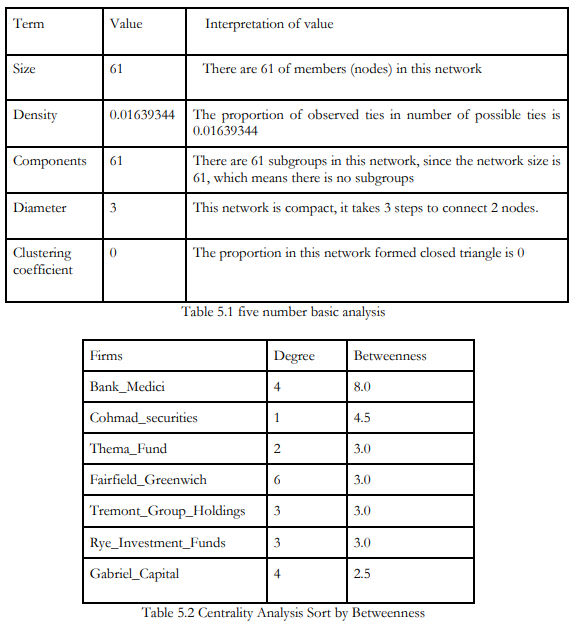
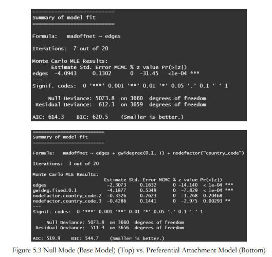

# Madoff-Fraud-Network-Analysis
## Method: Implemented Social Network Analysis in R Language. Applied analysis methods below:
1. 5 number summary analysis(Network Size, Density, Components, Diameter, Clustering Coefficient)
2. ERGM model for perferential attachment analysis for this project.
## Dataset:
1. UCINET: demonstrated the finance flows between financial institutions and Bernie Madoff's investment firm (a total of 61 firms)
2. Location of firms, investor types, and the amount of potential exposure to the fraud (data collected from news stories, court documents and government agencies)
## Visualizations of the Network:
1. Network Visualization (Domestic Firsm vs. International Firms)
 

2. Network Analysis From 7 Continents and Unknown Location

3. Network Analysis of Investor Types

## Social Network Analysis Results

The centrality analysis identified the 3 major feeders for the Madoff
Investment Scheme; Fairfield Greenwich Group (6 recruitments) and Bank Medici and Gabriel
Capital (4 recruitments each). Additionally, the betweenness centrality analysis revealed that Cohmad
Securities was the top feeder, albeit indirectly, with 8 recruitments. Inadvertently, through growing
the network on Madoff’s behalf these firms also increased the amount of investors who were
financially exposed.
## ERGM Model Results:

An ERGM model was performed to test for preferential attachment in the network and
nodefactor was used to identify the nodes more likely to form ties than others. According to the
results, the estimate is below 0 and the p-value is smaller than 0.05. This means there is a preferential
attachment effect in the network. The implication of this result is that as with typical preferential
attachment networks, the rich, or in this case Madoff, continued to get richer. 
Nodefactor means the international firms are more likely to form ties than others. As the p-value of country code 3 = international firms, is smaller than 0.05, which is statistically significant. The implication of this result
is that many of Madoff’s ties were based in Europe, which meant that much of the money that was
lost in the fraud was based out of Europe.
